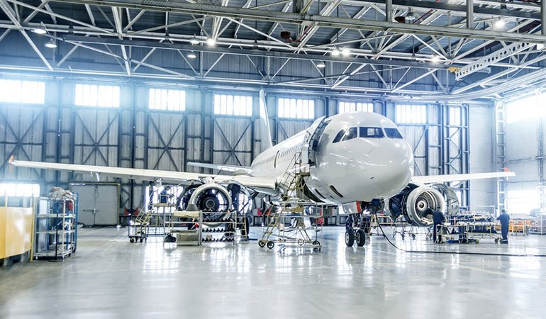
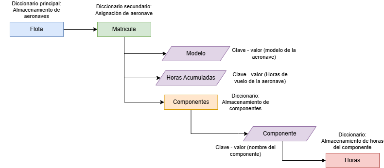
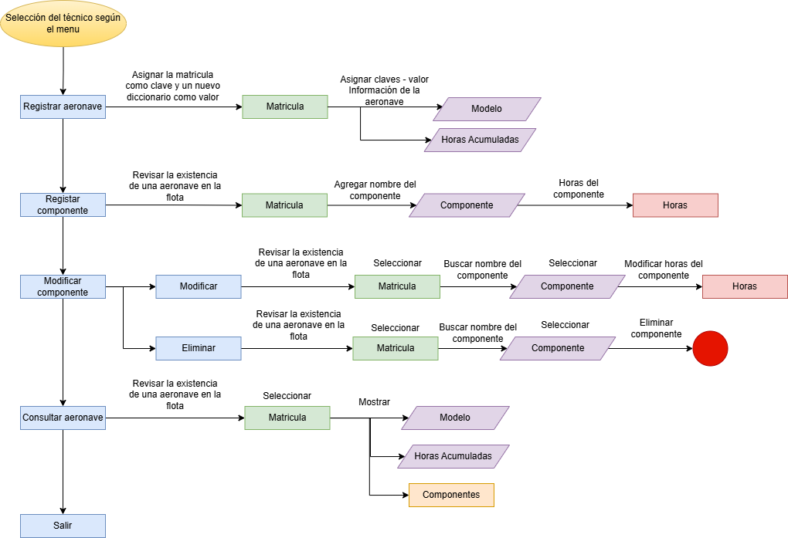

# Gestión de Mantenimiento de Flota Aeronautica

## Contexto
Una aerolínea regional necesita un prototipo de sistema básico para gestionar las horas de vuelo de sus aeronaves y el inventario de piezas críticas sometidas a mantenimiento. Como ingenieros aeronáuticos, su misión es diseñar un algoritmo en Python que permita registrar y consultar esta información utilizando las estructuras de datos vistas en clase (Listas y Diccionarios).

## Descripción de la Tarea

Deben crear un programa interactivo por consola que permita a los técnicos de mantenimiento realizar las siguientes acciones:

1. **Registro de Aeronaves:** El programa debe permitir al usuario ingresar datos de al menos 3 aeronaves. Cada aeronave debe tener:
    - Matrícula (ej. HK-4532)
    - Modelo (ej. A320, ATR72)
    - Horas de vuelo acumuladas

2. **Registro de Componentes:** Por cada aeronave, se deben poder registrar componentes críticos (ej. Motor izquierdo, Tren de aterrizaje, Alabes del compresor) junto con sus horas de uso actuales y el límite de horas permitidas antes del mantenimiento.

3. **Almacenamiento de Datos:** Toda la información recolectada desde el teclado (`input()`) debe almacenarse de forma estructurada en **listas** y **diccionarios**.

4. **Consulta de Mantenimiento:** El sistema debe recorrer los datos almacenados y mostrar un reporte en pantalla de qué componentes de qué aeronaves han superado su límite de horas y requieren mantenimiento inmediato.

## Diagrama - Almacenamiento de datos
En la siguiente imagen se podrá visualizar el diagrama de la memoria para el almacenamiento de la aeronave y sus datos en una flota realizado en Draw.io

## Diagrama de bloques - Planteamiento
En la siguiente imagen se podrá visualizar el diagrama del planteamiento del problema, empleando la misma convección y codigo de colores empleado en el diagrama anterior.

            

